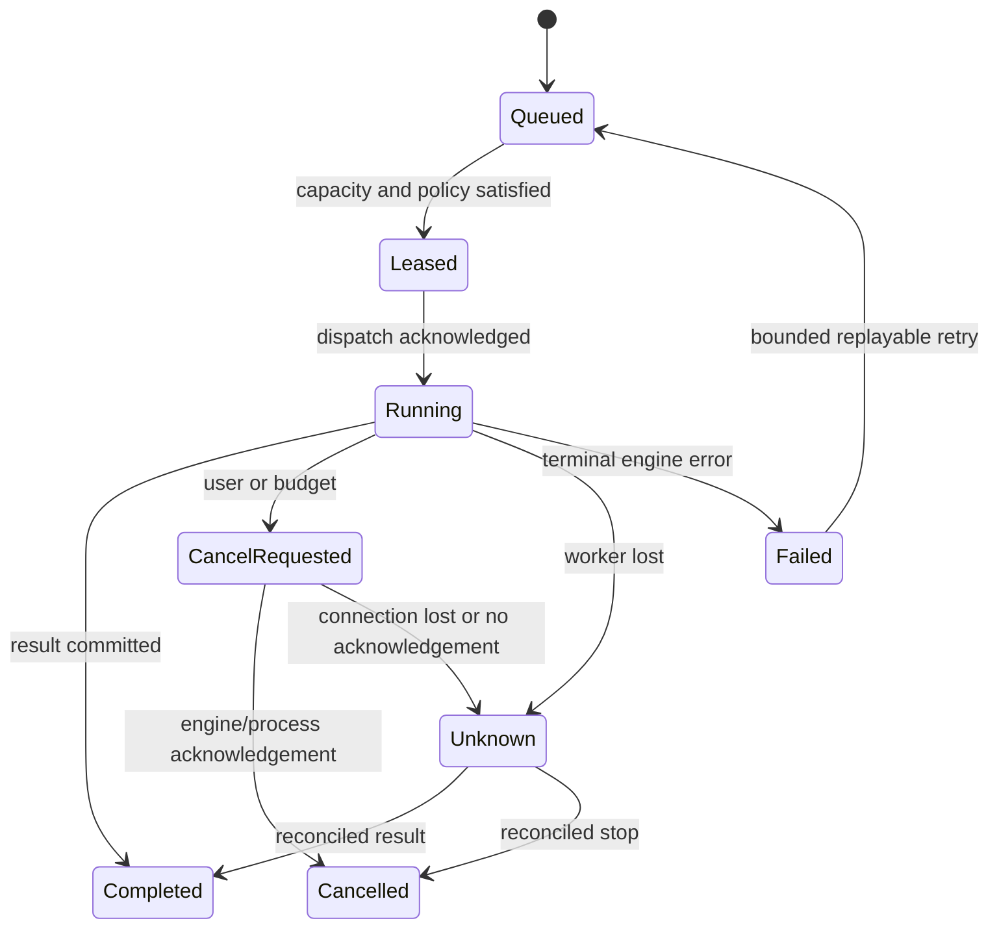

# Multi-agent and scheduler architecture

Proposed, 2026-10-02. This is a scheduler design, not a claim that the current orchestrator delegates work.

## Identities and delegation

A task owns a tree of agent runs. A main agent may propose bounded child tasks; independent top-level tasks are separate roots. A deterministic test job uses local tools and no model lease. An image job is not automatically a conversational agent; an agent can request it through a validated tool/job proposal.

Each child has parent/task IDs, role, goal, input artifact references, model constraints, output contract, deadline, depth, turn/token/cost budget, workspace mode, and a permission subset. Child prompts contain only necessary context. Child results return bounded summaries and evidence/artifact references, not unrestricted transcript copies.

Default nesting depth is one; default active-child limit is small and configurable after measurement. Spawn consumes the parent's aggregate budget and requires a allowed workflow/delegation scope. Children cannot recursively expand authority or invent more compute. Budgeting includes retries, compaction/summarization, and embeddings, not just visible final tokens. Parent termination cancels descendants unless an explicitly approved independent-job scope exists.

## Resource ownership

Separate three limits:

1. Logical agent-run admission: number of active/queued tasks, per-user and per-parent limits.
2. Inference request admission: tested engine slots and GPU/model allocation constraints.
3. Local tool admission: process limits, network limits, workspace write ownership, per-resource locks.

A running agent is often waiting for a tool/approval/child and need not hold a GPU request lease. Acquire inference leases per request, and release or reconcile them before waiting for children or human approval. A loaded model allocation may remain resident separately. Never reserve the only model slot for a parent that waits for its child on that same slot.

Workspace mutation defaults to one writer across all tasks/agents. Read-only research can parallelize using a consistent file view/version. Local test jobs may mutate build/cache files and must declare that scope; “test” does not imply read-only. Isolated worktrees are an optional explicitly authorized mode, with reviewed diffs and no automatic commit/push/merge.

## Durable queue and leases

SQLite stores queue items, requirements, parent priority, deadlines, attempts and leases. Scheduler selection is transactional: choose eligible task, verify worker/profile capacity and policy, reserve physical pool/service slots, create lease with fencing generation and bounded expiry, then dispatch the attempt. Model loading is a separate authorized allocation operation, not a side effect of arbitrary routing.

Priorities: interactive user work, then user-approved dependent children, then background schedules. Inherit priority for a child blocking its parent. Add age-based fairness and per-workspace quotas so research fan-out cannot starve interactive requests. Bound queue length and give a useful capacity reason when rejecting admission. Deadlines are compared against estimated queue/load/run time and worker expiry; estimates are explicitly uncertain.

Scheduler states for an attempt:

Lease timeout alone does not prove remote capacity is free. Mark the allocation unknown/quarantined, reconcile request status or obtain worker boot/restart evidence before reuse. Fencing prevents stale local owners from committing new state, but an opaque engine may not honor fences; in that case avoid dispatching duplicate requests until uncertainty is resolved.

## Example: bounded mixed compute

| Work | Route | Resource treatment |
| --- | --- | --- |
| Main coding agent | Existing Kaggle coding model | One dual-T4 model allocation, one measured request slot |
| Research child | Local smaller text model | Separate local pool; remote disclosure policy still applies if fallback is proposed |
| Image task | Private ComfyUI worker | Separate GPU pool, asynchronous prompt ID and artifact contract |
| Test job | Local process tool | Approved command/workspace/environment scope; no GPU request |

If research is routed back to the sole Kaggle allocation, requests queue. If image and coding share its GPUs, image waits for an approved allocation transition unless co-residency is measured safe. A user may run several logical agents on one slot, but throughput remains serialized/interleaved and the UI says so.

## Failures, retries and cancellation

Classify auth/policy/capability/schema errors as terminal until configuration changes. Network/429 errors may retry with exponential backoff, jitter, server retry hints, a finite attempt count, and the original task deadline. OOM reduces/quarantines a profile; timeout does not justify replaying unknown external effects. A child failure returns a structured outcome; parent chooses whether remaining evidence is sufficient or needs user guidance.

Cancellation first commits intent, prevents new tool/child dispatch, removes queued items, propagates descendant cancellation, aborts transport reads, and requests engine cancellation if supported. For local processes, terminate the owned process tree using an OS backend; on Windows evaluate Job Objects, not just killing the shell PID. Commit acknowledgements separately for inference, children and tools. Never advertise immediate GPU release on a disconnected stream alone.

A command already changed files before cancellation may have partial effects. Recovery records the uncertain result and reconciles; it cannot undo arbitrary shell/network actions. Approval grants are invalidated when arguments, target preimage, task identity, or policy revision changes.

## Background jobs and homelabs

The optional local daemon owns approved schedules, recurring job specs, UTC occurrence IDs, user timezone, missed-run behavior, overlap limits, resource budgets and retry policy. Define daylight-saving behavior explicitly; default missed runs coalesce into at most one occurrence rather than unbounded catch-up. Persist scheduled intent before dispatch and use `(schedule_id, occurrence_id)` uniqueness.

Jobs require an online local authority host and a persistent eligible worker. Sleep/network loss marks workers unknown and defers work. No ephemeral-notebook auto-restart/keepalive mechanism is proposed. Bots/MCP external actions receive separate scoped grants; installing an integration is not authorization to send messages or modify hosted systems.

If no approval client is connected, a risky action waits for a bounded time or denies. Unattended operation requires a deliberately reviewed standing grant specifying actions, paths, command/environment/network scope, expiry, budgets, and revocation. Default behavior remains interactive.

## Acceptance cases

One-slot parent/child cannot deadlock; child limits cannot exceed parent budget; alias endpoints cannot double-count GPUs; shared workspace writers cannot interleave unreviewed edits; expired leases cannot cause duplicate dispatch; cancellation blocks new effects; failed children produce explicit outcomes; daemon restart does not replay uncertain commands; local-only routing never sends data remotely. Exercise these with fake workers before real GPU acceptance.
