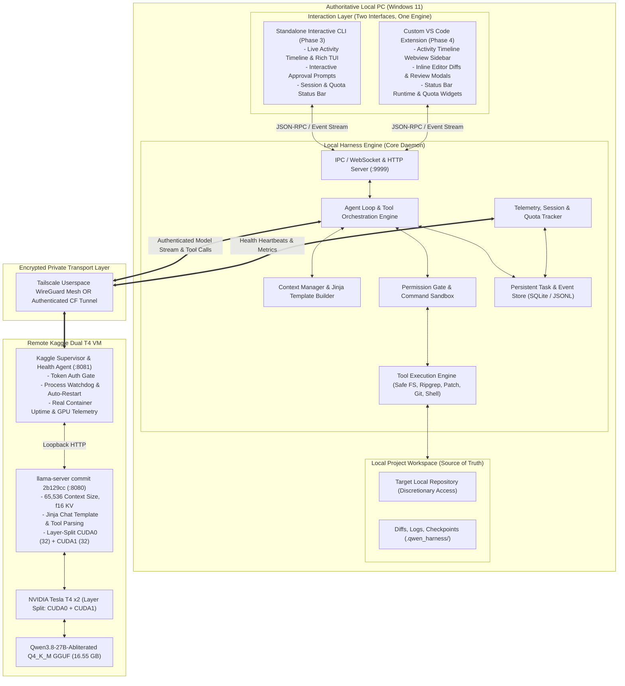

# Phase 0 Audit & Architecture Specification: Standalone Kaggle x Qwen Coding Harness

**Document ID:** `ARCH-PHASE0-KAG-QWEN-002`  
**Date:** 2026-09-27  
**Status:** Architecture Revision (Awaiting User Sign-off — No Code/GPU Executed)  
**Target Hardware:** Remote Kaggle Dual Tesla T4 (2 × 15,360 MiB VRAM, ~30 GiB RAM) | Local Windows 11 PC

---

## 1. Executive Summary & Verification of Existing Proof

### 1.1 Notebook Audit (`qwen3-8-27b-abliterated-q4-kaggle-dual-t4-proof.ipynb`)
Inspection of the exported Jupyter notebook (`qwen3-8-27b-abliterated-q4-kaggle-dual-t4-proof.ipynb`, 37 KB) confirms:
1. **Compilation Baseline:**
   - Source: `llama.cpp` commit `2b129ccfa03aea330d2d9ac4650a10de393dbe3a` (Release 0.5.0-dev, ggml 0.25.3).
   - CMake flags: `-DGGML_CUDA=ON -DGGML_CUDA_NO_VMM=ON -DCMAKE_CUDA_ARCHITECTURES=75 -DCMAKE_BUILD_TYPE=Release -DLLAMA_BUILD_TESTS=OFF`.
   - The flag `-DGGML_CUDA_NO_VMM=ON` successfully avoids the missing `CUDA::cuda_driver` CMake target on Kaggle CUDA 12.8 / driver 570.86.16.
   - Compilation time: ~3.5 minutes on Kaggle CPU with `--parallel 2`.
2. **Model Baseline:**
   - Repo: `huihui-ai/Huihui-Qwen3.8-27B-abliterated-GGUF` at revision SHA `3f101cd22b7999228bbd5d79a33975414eb9758b`.
   - Checkpoint: `Huihui-Qwen3.8-27B-abliterated-UD-DW-Q4_K_M.gguf` (16.55 GB decimal, 15.41 GiB binary).
   - Download speed on Kaggle network: ~8.1 MB/s to ~150 MB/s (~1.5 minutes).
3. **Execution & Allocation (32K Snapshot):**
   - Flags: `--split-mode layer --tensor-split 1,1 --n-gpu-layers 999 --ctx-size 32768 --parallel 1 --cache-type-k f16 --cache-type-v f16 --flash-attn auto --jinja --no-context-shift`.
   - VRAM footprint at 32K context:
     - CUDA0 (Tesla T4 0): 8,117 MiB used / 15,360 MiB total (~52.8%).
     - CUDA1 (Tesla T4 1): 9,237 MiB used / 15,360 MiB total (~60.1%).
   - Performance in snapshot:
     - Simple generation: 48 prompt tokens, 13 completion tokens in 1.8s. Prompt eval: 55.4 t/s (18.1 ms/tok), token eval: 12.7 t/s (78.7 ms/tok).
     - Tool-call probe: 306 prompt tokens, 27 completion tokens in 3.5s (prompt eval: 191.0 t/s, eval: 13.5 t/s). Correct function JSON returned for `lookup_symbol`.
4. **Live User Update Discrepancy Note:**
   - The file snapshot in the workspace reflects the **32,768** context setup.
   - The user live notebook subsequently tested **65,536** context with 46,722 input tokens (recall `jade river 93` in 171.5s, VRAM 9,187 MiB / 10,305 MiB).
   - Long coding chat: 2,334 prompt tokens (2,293 reported cached), 4,096 completion tokens, 316.5 seconds, `finish_reason=length`. Autoregressive speed: ~13.0 tokens/sec.
   - The proof notebook file on disk remains clean and unedited as the baseline control.

---

## 2. Core Architecture & Strategic Direction

### 2.1 Own Standalone Agent Harness & Custom VS Code Extension
- **Cline and OpenCode are RESEARCH REFERENCES ONLY.** We do not adopt them as runtime dependencies, primary controllers, or UI wrappers.
- We are building our **OWN standalone coding-agent harness** and our **OWN VS Code extension**, delivering an experience matching the interaction quality of Codex and Claude Code.
- **Phased Delivery Strategy:**
  1. Build and validate the **standalone harness engine** first with a rich, interactive **CLI** (terminal UI, real-time activity timeline, approvals, local tool execution, persistent SQLite/JSONL task journal, and Kaggle connection management).
  2. Build our **custom VS Code extension** that communicates directly with the local harness engine via a local IPC/WebSocket event stream.

### 2.2 System Architecture Diagram



### 2.3 Architecture Axioms:
1. **Zero Raw Workspace Exfiltration:** The Kaggle notebook NEVER mounts the Windows filesystem, receives bulk repo archives, or executes shell commands on the user's PC.
2. **Local Authority:** Filesystem modifications, Git operations, test execution, and symbol indexing occur 100% locally on Windows under human-in-the-loop authorization.
3. **Decoupled Local Engine:** Both the CLI and the future VS Code extension are thin presentation clients over the same local harness daemon. The harness daemon maintains task state, executes tools, enforces permissions, and tracks telemetry.

---

## 3. Kaggle Networking, Security & Lifecycle Verification

### 3.1 Kaggle Network Environment Audit
- **Outbound Connectivity:** Allowed when "Internet ON" is enabled in session settings. Outbound TCP/UDP traffic is routed through Google Cloud NAT.
- **Inbound Connectivity:** Strictly **BLOCKED**. Kaggle VMs do NOT possess public IPv4 addresses, and inbound port forwarding from the public internet is impossible.
- **Tunnels & Provider Policies:**
  - *Unauthenticated public tunnels (e.g. basic ngrok/localtunnel):* Strictly forbidden by our security model and susceptible to botnet scanning, abuse bans, and token leaks.
  - *Tailscale (Userspace WireGuard Mode):* **Primary Recommendation.** The Kaggle supervisor launches a static `tailscaled` binary in userspace mode (`--tun=userspace-networking`). It establishes an outbound WireGuard/DERP tunnel directly into the user's private tailnet. Only authenticated nodes owned by the user can route requests to the Kaggle node. There is zero public internet exposure.
  - *Cloudflare Named Tunnel:* **Secondary Alternative.** Outbound HTTPS tunnel to Cloudflare Edge using an account token. The Kaggle supervisor enforces HTTP `Authorization: Bearer <shared_secret>` validation on every incoming request.

### 3.2 Session Lifetime vs. Measured Connected Uptime
To guarantee complete honesty and avoid invented session metrics:
1. **Kaggle Session Max Limit:** Documented platform hard cutoff of **12.0 hours** for interactive GPU notebooks.
2. **Kaggle Container Runtime:** Extracted directly from `/proc/1/stat` or `/proc/uptime` by our Kaggle supervisor and emitted in the heartbeat payload. If the container runtime is available, the UI displays `Container Age: Xh Ym / 12h max`.
3. **Harness Connected Uptime:** Locally measured timer starting from the exact second the local harness establishes an authenticated link to the Kaggle supervisor.
4. **Estimated Time to Kaggle Termination:** Computed as `12.0 hours - Container Runtime`. If container runtime cannot be verified, it is displayed as `Session Limit: 12h (Connected: Xh Ym, container start time unverified)`.
5. **Session Expiry Warning:** Visual warning triggered at 11h 00m (60 mins remaining) and high-priority alert at 11h 30m (30 mins remaining) to prompt clean state serialization.

### 3.3 Account GPU Quota UX (Truthful Accounting)
- Kaggle provides **no machine-readable REST API** for remaining account weekly GPU quota.
- **Honest Tracking Mechanism:**
  - On harness startup or configuration, the user can input their *Dashboard-Observed Quota* (e.g., "26.5 hours remaining as of 27-Sep 10:00 UTC").
  - The harness tracks cumulative connected GPU usage locally with millisecond resolution.
  - UI displays:  
    `Weekly Quota: ~24.2h est. remaining (Source: User-Observed 26.5h as of 27-Sep; Local run usage: 2h 18m) [ESTIMATE]`
  - Explicit tooltip/label: *"Kaggle does not expose a real-time quota API. Actual remaining hours must be checked on the Kaggle web dashboard."*

---

## 4. Physical Performance Realities & Microbenchmark Strategy

### 4.1 Measured Hardware Baseline (Dual Tesla T4)
We reject ungrounded or speculative speed claims. Our engineering design is grounded strictly in measured performance:
1. **Autoregressive Generation Speed:**
   - Measured output speed: **12.7 to 13.5 tokens/sec**.
   - Dual T4 GPUs use PCIe Gen3 x16 with layer-splitting. Physical GDDR6 memory bandwidth (320 GB/s per card) and inter-card communication constrain generation speed to ~13 t/s for a 27B Q4 model.
   - *Impact on UX:* A 1,000-token response takes ~75 seconds. Multi-page non-streamed generations feel unresponsive.
   - *Architectural Requirement:* Compulsory token-by-token SSE streaming, small granular tool turns (50–300 tokens per patch), and an immediate user cancellation trigger.
2. **Prompt Prefill Speed & Context Latency:**
   - 48 prompt tokens: 0.86s (~55.4 t/s).
   - 306 prompt tokens: 1.60s (~191.0 t/s).
   - 46,722 prompt tokens: 171.5s (~272.4 t/s).
   - *Impact on UX:* A cold 48K prompt takes nearly 3 minutes of prefill before generating the first token!
3. **Prefix Stability & KV Cache Optimization:**
   - In user testing, a prompt with a stable prefix achieved 2,293 cached tokens out of 2,334 prompt tokens, drastically reducing prefill latency to sub-second response times.
   - The harness prompt builder must keep system prompts and tool schemas completely immutable and positioned at the very head of the context (`--no-context-shift` enabled) to ensure maximum KV cache hits in `llama-server`.

---

## 5. Unified Event Architecture & IPC Contracts

The local harness engine emits a standardized, append-only JSON event stream consumed by both the **Phase 3 CLI** and the **Phase 4 VS Code extension**.

### 5.1 Standard Event Types

```typescript
type HarnessEvent =
  | PhaseChangeEvent
  | TokenChunkEvent
  | ToolProposedEvent
  | ToolApprovalRequestEvent
  | ToolApprovalResponseEvent
  | ToolExecutedEvent
  | TelemetryHeartbeatEvent
  | TaskJournalCheckpointEvent;
```

### 5.2 Event Payloads

#### 1. `phase_change`
Signals agent state machine transitions:
```json
{
  "eventId": "evt_001",
  "runId": "run_a8f93e21",
  "timestamp": "2026-09-27T08:30:00.120Z",
  "type": "phase_change",
  "phase": "requesting_model", // planning | requesting_model | streaming_tokens | tool_proposed | awaiting_approval | executing_tool | verifying_diff | completed | failed | cancelled
  "detail": "Sending turn 3 prompt to Kaggle brain (estimated 1,450 tokens)"
}
```

#### 2. `tool_approval_request`
Emitted when the model proposes a sensitive operation (file write, patch, terminal command, git mutation):
```json
{
  "eventId": "evt_002",
  "runId": "run_a8f93e21",
  "timestamp": "2026-09-27T08:30:04.500Z",
  "type": "tool_approval_request",
  "toolName": "patch_file",
  "callId": "call_9f8d7c6b",
  "parameters": {
    "filePath": "src/utils/parser.py",
    "diff": "--- a/src/utils/parser.py\n+++ b/src/utils/parser.py\n@@ -12,3 +12,4 @@\n-    return val\n+    return val if val is not None else default\n"
  },
  "riskLevel": "medium",
  "reason": "Modify source code to prevent NoneType error in parser"
}
```

#### 3. `tool_approval_response`
Sent by the CLI or VS Code extension back to the harness daemon:
```json
{
  "eventId": "evt_003",
  "runId": "run_a8f93e21",
  "timestamp": "2026-09-27T08:30:12.100Z",
  "type": "tool_approval_response",
  "callId": "call_9f8d7c6b",
  "decision": "approved", // approved | rejected | approved_with_edits
  "modifiedParameters": null
}
```

#### 4. `telemetry_heartbeat`
Emitted every 5 seconds by the harness (merging local timers and remote Kaggle stats):
```json
{
  "eventId": "evt_004",
  "timestamp": "2026-09-27T08:30:15.000Z",
  "type": "telemetry_heartbeat",
  "connection": {
    "status": "connected",
    "transport": "tailscale",
    "latencyMs": 42
  },
  "runtime": {
    "connectedUptimeSeconds": 1420,
    "kaggleContainerUptimeSeconds": 3600,
    "kaggleSessionMaxSeconds": 43200,
    "estimatedSecondsToKaggleCap": 39600
  },
  "quota": {
    "lastObservedHours": 26.5,
    "observedTimestamp": "2026-09-27T10:00:00Z",
    "localRunConsumedHours": 0.39,
    "estimatedRemainingHours": 26.11
  },
  "remoteGpu": [
    {"index": 0, "name": "Tesla T4", "vramUsedMiB": 9187, "vramTotalMiB": 15360, "tempC": 58, "utilizationPct": 12},
    {"index": 1, "name": "Tesla T4", "vramUsedMiB": 10305, "vramTotalMiB": 15360, "tempC": 61, "utilizationPct": 14}
  ]
}
```

---

## 6. Project Implementation Phases

### Phase 0 — Audit & Architecture Specification (Current Gate)
- Deliverable: Finalized, verified architecture document.
- Scope: Zero code commits, zero package installations, zero GPU/Kaggle executions. Stop for user sign-off.

### Phase 1 — Reproducible Remote Kaggle Brain
- Deliverable: Clean cloned Kaggle notebook `kaggle/qwen38_t4_dual_server.ipynb` and supervisor script `kaggle/supervisor.py`.
- Features:
  - Pinned `llama.cpp` commit (`2b129cc`) with verified `-DGGML_CUDA_NO_VMM=ON` build flags.
  - Dedicated lightweight Python supervisor process on Kaggle container listening on `:8081`.
  - Process watchdog to auto-restart `llama-server` on failure.
  - Token-authenticated endpoints (`/v1/chat/completions`, `/health`, `/slots`).
  - Container uptime extraction (`/proc/1/stat`) and dual-GPU telemetry via `pynvml` or `nvidia-smi`.
  - Zero modification to the proof notebook.

### Phase 2 — Core Local Harness Engine & Secure Transport
- Deliverable: Local Python engine running on Windows PC (`harness/`).
- Features:
  - Setup and validation of private transport (Tailscale userspace node or authenticated Cloudflare Tunnel).
  - Streaming OpenAI-compatible client with SSE chunk parsing and immediate keep-alives.
  - Structured function-calling adapter supporting Qwen's Jinja tool calling format.
  - Explicit request cancellation: aborting a local request sends immediate release to remote `llama-server` slot.
  - Auth negative tests and network reconnect resilience.

### Phase 3 — Standalone Interactive CLI Coding Agent
- Deliverable: Fully functioning CLI coding agent (`harness/cli/`).
- Features:
  - Rich interactive terminal UI (using `rich` / `prompt_toolkit`).
  - Real-time Activity Timeline: collapsible status blocks for model requests, token streaming, tool calls, and test executions.
  - Safe Tool Execution Engine:
    - Path-allowlisted filesystem reader and search (ripgrep symbol lookup).
    - Unified diff patcher with syntax and boundary validation.
    - Sandboxed local shell runner (PowerShell / cmd) with explicit user approval prompts.
    - Git status and commit manager.
  - Persistent SQLite & JSONL task journal (`.qwen_harness/journal.jsonl`) supporting task interruption and resumption.
  - Integrated Session & Quota dashboard displayed in terminal header/footer.
  - Tested on an isolated disposable test repository (`disposable-test-repo/`).

### Phase 4 — Custom Dedicated VS Code Extension
- Deliverable: Native VS Code Extension (`extension/`).
- Features:
  - Communicates directly with the local harness engine daemon via local WebSocket / JSON-RPC.
  - Dedicated Sidebar Webview:
    - Activity Timeline showing live step-by-step agent actions.
    - Streaming response view with markdown rendering.
    - Inline approval cards for file diffs and shell commands.
  - Editor Integration:
    - Native side-by-side diff viewer for proposed file changes.
    - Clickable file and symbol links.
  - Status Bar Widgets:
    - Live Kaggle connected uptime vs. 12h container cap countdown.
    - Dual T4 VRAM utilization meters.
    - Estimated weekly GPU quota indicator.
  - Global Cancel button to halt in-flight agent tasks immediately.

### Phase 5 — Long-Horizon Reliability, Memory & Microbenchmarks
- Deliverable: Production hardening and benchmark validation.
- Features:
  - Context compaction and summarization strategy for multi-turn tasks.
  - Safe checkpoint recovery when Kaggle 12-hour session boundary is reached.
  - Execution of complete microbenchmark suite (BM-01 through BM-06).

---

## 7. Proposed Repository Layout

```text
Local AI via Collab/
├── KAGGLE_QWEN_CODING_HARNESS_HANDOFF.md    # Handoff instructions (frozen)
├── qwen3-8-27b-abliterated-q4-kaggle-dual-t4-proof.ipynb # Baseline proof notebook (frozen)
├── PHASE_0_AUDIT_AND_ARCHITECTURE.md        # This specification
├── kaggle/                                  # Phase 1: Remote Brain
│   ├── supervisor.py                        # Lightweight auth gateway & process monitor (:8081)
│   ├── qwen38_t4_dual_server.ipynb          # Cloned, clean Kaggle deployment notebook
│   └── setup_artifacts.py                   # Script for optional private dataset caching
├── harness/                                 # Phase 2 & 3: Local Engine & CLI
│   ├── pyproject.toml                       # Poetry / pip requirements
│   ├── daemon.py                            # Local background service & IPC server (:9999)
│   ├── core/
│   │   ├── orchestrator.py                  # Agent turn loop & state machine
│   │   ├── context.py                       # Prompt builder & prefix cache stabilizer
│   │   └── client.py                        # Authenticated streaming client to Kaggle
│   ├── tools/
│   │   ├── base.py                          # Tool interface & approval schema
│   │   ├── fs.py                            # Path-sandboxed file operations
│   │   ├── search.py                        # Ripgrep symbol & text search
│   │   ├── patch.py                         # Unified diff generator & validator
│   │   └── terminal.py                      # Subprocess runner with permission gates
│   ├── telemetry/
│   │   ├── session_tracker.py               # Uptime vs Kaggle limit calculator
│   │   └── quota_ledger.py                  # User-observed quota & consumption ledger
│   ├── storage/
│   │   └── journal.py                       # SQLite / JSONL task persistence & checkpoints
│   └── cli/
│       ├── main.py                          # CLI entry point (`qwen-agent`)
│       ├── timeline.py                      # Rich terminal live activity renderer
│       └── prompts.py                       # Interactive permission & input prompts
├── vscode-extension/                        # Phase 4: Custom VS Code Extension
│   ├── package.json                         # Extension manifest & commands
│   ├── src/
│   │   ├── extension.ts                     # Extension activation & daemon lifecycle
│   │   ├── client/
│   │   │   └── harness_client.ts            # WebSocket / JSON-RPC client to local daemon
│   │   ├── providers/
│   │   │   ├── timeline_view_provider.ts    # Sidebar activity timeline webview
│   │   │   └── diff_content_provider.ts     # Virtual document provider for inline diffs
│   │   └── ui/
│   │       ├── status_bar.ts                # Session timer & GPU quota status bar items
│   │       └── webview/                     # React / Vanilla JS webview frontend
│   │           ├── index.html
│   │           ├── timeline.tsx
│   │           └── components/
└── tests/
    ├── microbenchmarks/
    │   ├── bm01_ttft.py                     # Time-to-first-token & prefill rate
    │   ├── bm02_tool_call.py                # Function calling syntax adherence
    │   └── bm03_prefix_cache.py             # KV cache reuse verification
    ├── unit/
    │   ├── test_fs_sandbox.py               # Path traversal negative tests
    │   ├── test_patch_validator.py          # Unified diff safety checks
    │   └── test_telemetry.py                # Session & quota calculation logic
    └── integration/
        ├── test_cli_loop.py                 # End-to-end CLI mock agent loop
        └── test_daemon_ipc.py               # WebSocket event protocol verification
```

---

## 8. Updated Measurable Acceptance Test Matrix

| Test ID | Area | Objective | Acceptance Criteria |
| :--- | :--- | :--- | :--- |
| **A-01** | Kaggle Remote | Clean Server Bootstrap | Cloned notebook runs from top to bottom; supervisor healthy on `:8081` in < 6 mins. Baseline proof notebook unchanged. |
| **A-02** | Security | Ingress & Auth Barrier | Kaggle server unreachable from public web; requests without valid Bearer token return HTTP 401 Unauthorized. |
| **A-03** | Hardware | Dual T4 Layer Allocation | VRAM utilized across both GPUs at 65K context (GPU0: ~9.2 GiB, GPU1: ~10.3 GiB); zero CUDA OOMs. |
| **A-04** | Telemetry | Honest Session & Quota UI | UI clearly distinguishes locally measured connected uptime from Kaggle container uptime; displays user-entered quota as `ESTIMATE`. |
| **A-05** | Performance | Streaming & Token Latency | First token streamed within 3.0s on short prompts; continuous SSE delivery at ~13 tokens/sec without UI lockup. |
| **A-06** | Engine | Tool Call & Diff Approval | Agent pauses at `awaiting_approval` before any write or shell command; user rejection cancels action without corrupting state. |
| **A-07** | Engine | Sandbox Path Traversal | Attempting to read/write outside target directory (`../../etc/passwd` or `C:\Windows`) raises security violation and aborts. |
| **A-08** | Engine | Cancellation Responsiveness | Issuing cancel (Ctrl+C in CLI or Cancel button in UI) halts local tool execution and frees the remote llama.cpp slot within 1.0s. |
| **A-09** | CLI | Full Standalone Agent Loop | CLI executes multi-step task on `disposable-test-repo/` (read file, patch bug, run test) with complete activity timeline. |
| **A-10** | Extension | VS Code Event Integration | Custom VS Code extension renders real-time timeline, interactive diffs, and status bar meters matching CLI behavior. |

---

## 9. Explicit Sign-Off Request for User Approval

Before any code is committed, files generated, dependencies installed, or Kaggle runs initiated, the following architectural choices require user sign-off:

1. **Strategic Architecture Sign-Off:** Approve building our **own standalone coding-agent harness (CLI first)** and our **own custom VS Code extension (Phase 4)**, treating Cline/OpenCode strictly as research references.
2. **Secure Transport Selection:** Confirm preference between **Tailscale userspace node** (private mesh, recommended) vs. **Authenticated Cloudflare Tunnel**.
3. **Execution Plan:** Approve proceeding to **Phase 1** (creating `kaggle/supervisor.py` and the cloned deployment notebook `kaggle/qwen38_t4_dual_server.ipynb`).

**Current Status:** Architecture fully revised and verified. Proof notebook preserved. Awaiting your approval.
