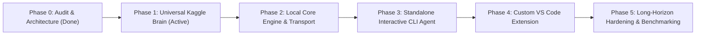

> **Historical document ? notice added 2026-10-02.** Its original body is preserved. Completion, safety and performance statements below are prior reports, not current acceptance evidence. Read the [V2 research index](README.md) and [current source audit](CURRENT_ARCHITECTURE_AUDIT.md) before implementation. V2 remains awaiting explicit user review and approval.

# Knowledgebase: Project Roadmap & Milestones

**Project:** Standalone Kaggle x Qwen Coding Harness  
**Current Milestone:** Phase 1 (Universal Remote Brain & Supervisor)  
**Target Completion:** Production-grade Local AI Pair Programmer with VS Code Extension  

---

## Roadmap Overview

---

## Detailed Milestone Objectives

### Phase 1: Universal Remote Kaggle Brain & Supervisor
* **Objective:** Produce a robust, parameterized remote runtime on Kaggle that boots in < 30 seconds with cached datasets (or < 6 mins on cold start), validates Dual T4 layer-splitting at 65K context, and exposes an authenticated health and proxy API.
* **Deliverables:**
  - `kaggle/supervisor.py`: Authenticated proxy, watchdog, health monitor.
  - `kaggle/universal_dual_gpu_server.ipynb`: Parameterized notebook for Qwen (or any GGUF).
  - `kaggle/dataset_builder.ipynb`: One-time artifact creation notebook.

### Phase 2: Local Core Engine Daemon & Transport Bridge
* **Objective:** Establish the Windows local daemon that handles authenticated streaming communication, slot management, request cancellation, and telemetry polling.
* **Deliverables:**
  - `harness/daemon.py`: Background IPC server on Windows.
  - `harness/core/client.py`: Streaming SSE client with TTFT tracking.
  - `harness/telemetry/session_tracker.py`: Real-time session countdown and quota calculation.

### Phase 3: Standalone Interactive CLI Coding Agent
* **Objective:** Deliver a complete, functioning autonomous coding assistant in the terminal matching Claude Code / Codex UX.
* **Deliverables:**
  - `harness/cli/`: Rich terminal activity timeline, approval prompts.
  - `harness/tools/`: Path-sandboxed file tools, ripgrep symbol indexer, unified diff patcher, shell executor.
  - `harness/storage/journal.py`: SQLite / JSONL task journal with checkpointing.
  - Verification on `disposable-test-repo/`.

### Phase 4: Dedicated Custom VS Code Extension
* **Objective:** Deliver a native VS Code extension that connects to the local harness daemon, offering a graphical activity timeline, side-by-side diff review, and status bar telemetry.
* **Deliverables:**
  - `vscode-extension/`: TypeScript extension, sidebar webview, diff provider, status bar widgets.

### Phase 5: Long-Horizon Hardening & Benchmark Validation
* **Objective:** Stress-test the system on multi-turn long-horizon tasks, implement context compaction, test graceful reconnect across Kaggle 12-hour session expirations, and run microbenchmarks BM-01 through BM-06.
