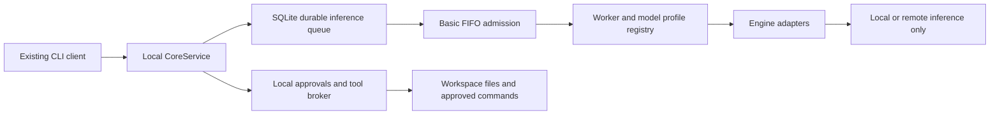

# V1 engine and worker backend

Real-worker preparation, 2026-10-02: use the feature branch's corrected
`kaggle/freecompute_dual_gpu_server.ipynb` and the exact manual procedure in
[V1_REAL_KAGGLE_ACCEPTANCE.md](V1_REAL_KAGGLE_ACCEPTANCE.md). Both server wrappers
are synchronized; historical proof output is preserved. Preparation does not
start a GPU session or certify streaming/model behavior. Real results remain
unverified until the user returns an authorized endpoint. The subsequently
requested Cloudflare URL option is available for startup checks; Quick Tunnels'
SSE limitation does not qualify it for streaming acceptance.

2026-10-02. Authorized continuation from Stage 3 acceptance
`aa15fc9fa87c45624acfc8eaf1aa5795f6603578` on
`v2/safety-and-agentdriver-spike`. Stages 1-3 are preserved. This milestone ends
with branch review; no merge, deployment, daemon or real GPU session.

Implementation acceptance checkpoint:
[`bec6b21e42e7c80742f2bda61a8936695f4826b4`](https://github.com/sumitahmed/FreeCompute/commit/bec6b21e42e7c80742f2bda61a8936695f4826b4)
(`feat: checkpoint minimal worker scheduler backend`). Its ancestry preserves the
implementation/test timestamp checkpoints and all accepted Stage 1-3 milestones;
none were rewritten. A following documentation checkpoint records this pointer.
Local and remote `main` were checked at
`1300566dca62a0f804487e7101767e688e551184` before branch finalization.

## Implemented boundaries — Observed



Core owns task state, proposals, approvals, file tools and journals. Remote
inference receives messages/schemas, never local tool handles. The narrow native
driver and all earlier permission/unknown-effect guards remain in place.

| Boundary | Production implementation |
| --- | --- |
| Engine contract and declarations | `harness/core/runtime_models.py` |
| Engine implementations | `harness/core/engines.py`, `harness/providers/openai_compatible.py` |
| Configuration/composition | `harness/config.py`, `harness/core/engine_config.py`, `CoreService.from_config` |
| Worker/profile registry | `harness/core/workers.py` |
| Admission, leases and resources | `harness/core/scheduler.py`, `harness/core/inference.py` |
| Additive schema-v2 migration | `harness/storage/scheduler_schema.py`, `harness/storage/runtime.py` |
| CLI presentation | `harness/cli/core_client.py`, `harness/cli/main.py` |

Engine specifics stay in adapters and composition. The broker handles scheduling,
durable intent, normalized text responses, cancellation tokens and bounded
streaming; it does not choose GPU topology or assume remote cancellation.

## Engine contracts — Observed and Tested locally

| Engine | Health and model information | Operations | Honest limits |
| --- | --- | --- | --- |
| llama.cpp / existing supervisor | Existing authenticated health contract; configured profiles; direct `ok` normalized to healthy | Text/SSE and declared code tools using existing client | No remote cancellation acknowledgement; configured model availability is a declaration |
| Generic OpenAI-compatible | Authenticated `/v1/models`; selected model must be advertised | Chat/SSE; text by default, tools only with explicit declared capability | Compatible syntax does not prove template/tool/context conformance; no GPU/session telemetry fabricated |
| Existing ComfyUI | Existing device health and configured workflow identity | Existing `/prompt`, correlated `/history`, `/view` download | Image only; no text/stream, bearer-auth contract, arbitrary checkpoint switching or remote cancellation acknowledgement |

The text adapters share the existing HTTP/SSE client. A request uses the selected
profile's model identity, rather than a fixed adapter model alias. Generic API
bases may end in `/v1`; SSE accepts `data:` with or without a following space.
Redirected authenticated health requests are refused. SSE lines/output are
bounded; an independent local deadline interrupts quiet reads. Closing a socket
does not prove server work stopped.

ComfyUI keeps the existing fixed workflow and 180-second polling limit. One
attachment names one workflow/model identity; unsupported timeout overrides,
image bearer credentials and multiple model identities are rejected. A successful
image receipt includes the sanitized result and a workspace artifact SHA-256.
Restart can consume that receipt without another remote job. A missing/changed
artifact or older receipt without a witness requires inspection; it is never
silently regenerated. This is a recovery witness, not a new artifact-retention
or configurable media-workflow subsystem.

No new runtime dependency was added. vLLM/Ollama can be assessed through the
generic adapter where they implement this protocol; neither has separate new
code or a claimed acceptance result.

## Workers and profiles — Observed

A worker has a stable ID, location (`local`, `kaggle`, `private`, `homelab` or
`remote-supervisor`), engine, model memberships, capabilities, concurrency,
physical resource pool/IDs and timestamped health/resource observations. Adapter
objects, actual endpoint URLs and credentials stay in process memory/config;
the database stores only an endpoint identity fingerprint. Observations/events
are scrubbed. Worker identity/capacity/resource/model changes are refused while
its active or quarantined leases are held.

Profiles are independent of workers. They record ID/model, accepted engines,
capabilities, declared context/output budgets, tool-result bound, optional
tokenizer/template references, exclusive resources and verification status
(`declared`, `unverified`, `fixture-tested`, `verified`). One profile can run on
multiple eligible workers. IDs cannot silently change declarations. The original
embedding API alone can replace a terminal fixture profile, retaining the old
declaration in history; unfinished tasks/leases prevent this compatibility path.
The original `worker_id` profile field remains a legacy routing hint.

Health is invalidated on restart/reattachment. Configured network workers need a
successful fresh probe, with a 30-second eligibility TTL. Reconnection does not
free quarantined resources. `last_seen` records healthy contact, while unhealthy
observations retain their age. Observed VRAM is information, not capacity.
Implicit in-process legacy test embeddings use a labeled trusted declaration;
this does not certify a network worker.

## Configuration and CLI — Tested with loopback fixtures

The existing single-supervisor configuration remains supported, including the
Stage 3 text profile ID used for resume. Its text/image attachments share one
conservative resource token until physical placement is explicitly declared.
Explicit `model_profiles` and `workers` must be supplied together. Use an
environment-variable reference for private credentials. URLs reject embedded
credentials, queries and fragments.

Example shape only; replace model names and budgets with accepted server values:

```yaml
selected_profile: local-text
model_profiles:
  - profile_id: local-text
    model: MODEL_FROM_LOCAL_SERVER
    engine: openai-compatible
    capabilities: [text]
    context_capacity: 4096
    reserved_completion: 512
    verification: unverified
  - profile_id: kaggle-code
    model: MODEL_FROM_LLAMA_SERVER
    engine: llama.cpp
    capabilities: [text, code_tools]
    resource_requirements: [gpu0, gpu1]
    verification: unverified
workers:
  - worker_id: local-small
    location: local
    engine: openai-compatible
    url: http://127.0.0.1:8000/v1
    profiles: [local-text]
    concurrency_limit: 1
  - worker_id: kaggle-qwen
    location: kaggle
    engine: llama.cpp
    url: http://127.0.0.1:8081
    api_key_env: WORKER_API_KEY
    profiles: [kaggle-code]
    concurrency_limit: 1
    resource_pool: kaggle-dual-t4
    resources: [gpu0, gpu1]
```

The existing CLI is still a Core client. Added commands are `/workers`, `/models`,
`/queue`, `/run-next`, `/model <profile> [worker]`, `/cancel [task]`, and
`/reconcile-inference [lease]`. CLI options include `--engine`, `--profile` and
`--worker`. Default selection never rebinds a previously queued task. Queue,
worker, model and health displays use Core queries/events. Generic worker health
does not invent Kaggle uptime/session timers.

## Evidence ledger

**Tested:** unchanged baseline 140 unit tests passed in 22.947s. During this phase,
31 focused worker/scheduler tests passed in 2.114s and 12 authenticated adapter/
actual-CLI tests passed in 13.959s. These include three deterministic workers,
real SQLite leases, shared-pool conflicts, two actual concurrent broker requests,
FIFO/restart/cancel/failure, model routing, ComfyUI download and image receipt
recovery. Final acceptance on Python 3.12.10:

| Executed check | Result |
| --- | --- |
| Complete unit suite | **189 passed in 42.993s**: prior 140 unchanged, 31 worker/scheduler, 12 engine/CLI, 3 migration and 3 new process-recovery checks |
| Original pinned SDK characterization | **15 passed in 7.054s**; its guard blocked one external tokenizer metadata attempt |
| Preserved SDK foundation suite | **28 passed in 139.434s**; zero external attempts reported; negative adoption-gate tests still measure rejection, not qualification |
| Repository security scanner | Exit 0; 152 files scanned, zero configured secret-pattern findings |
| Git whitespace/scope check | No whitespace errors; phase contains only the 26 inventoried paths; original tests/notebooks/SDK fixtures unchanged |
| Fresh PEP 517 wheel + separate target install | All **50** packaged `harness` Python files match working source and installed bytes |
| Installed imports and CLI | **49** default modules imported from the target; optional SDK adapter excluded from the default import pass; no OpenHands/LiteLLM loaded or mandatory SDK dependency |
| Actual installed `freecompute.exe` | Help, three-worker visibility, plain model + selected code worker, approved write and real Python test (exit 0, two receipts), second-process resume with zero additional inference/receipt changes, persisted queue restart/dispatch, one correlated ComfyUI PNG download |

Installed workflow: four text requests total (three edit/chat turns plus one
explicit queued dispatch), one image job, and image bytes matched the fixture.
Wheel SHA-256: `3c808e890effa4e5acb730e8658e8b889eb3b558b7a8c108a11e02c70fbbf40e`.
Build/source/install and runtime fixtures stayed outside the repository under
temporary local directories. The initial package helper inspected `outputs/`
instead of the existing provider's `output/`; correcting that external check
produced the successful fresh install run. Production code was unchanged by that
correction. Tests and logs are fixture acceptance, not a supported release matrix.

**Historical:** original Kaggle notebooks/configuration and reported benchmarks
are preserved unchanged from `aa15fc9`. No historical performance number was
reproduced or promoted to current evidence.

**Unverified:** actual GPU/model/tool-template/tokenizer/context/capacity/license,
real tunnel behavior, performance and server cancellation acknowledgement. All
worker/model names and GPU observations in deterministic tests are fixtures.

Protocol references inspected on 2026-10-02: [llama.cpp server documentation](https://raw.githubusercontent.com/ggml-org/llama.cpp/master/tools/server/README.md),
[OpenAI chat reference](https://developers.openai.com/api/reference/resources/chat),
[model-list reference](https://developers.openai.com/api/reference/resources/models/methods/list),
and [ComfyUI server source](https://raw.githubusercontent.com/comfyanonymous/ComfyUI/master/server.py).
These mutable upstream references describe protocol shape; they do not pin an
accepted deployed engine or prove hardware compatibility.

## Sequential adversarial review and discovered bugs

Review scope is the changes since `aa15fc9`; no subagents were used.

| Persona | Finding | Resolution and evidence |
| --- | --- | --- |
| Saboteur | Task creation could precede durable queue insertion; an event callback could detach the engine after admission; late cancel could overwrite completed state | Submission/queue share a transaction; engine captured within admission; terminal cancel guarded. Rollback, concurrency and cancellation regressions pass |
| Saboteur | Saved image result could be lost between inference receipt and task completion; failed text receipt could be retried on restart | Artifact witness and committed response consumption; restart recovery uses receipts without dispatch; changed artifact blocks regeneration |
| New Hire | Global profile/allocation selection blocked unrelated healthy workers and could rebind queued work; image configuration implied unsupported model switching | Task-owned profiles/routes, per-worker admission, explicit single Comfy workflow identity; dedicated routing/default-selection tests pass |
| Security Auditor | Legacy root URL accepted queries/fragments; generic health redirects could forward credentials; observations could persist raw errors | Strict URL validation, no authenticated redirects, scrubbed registry/receipt/event sinks; negative auth/redirect/redaction tests pass |

The image receipt issue affected both correctness and result provenance and was
treated as blocking until fixed. Review verdict for release remains **CONCERNS**:
physical resource declarations cannot fence other programs/workspaces, and private
state/snapshots have no new encryption/retention policy. These are explicit V1
limits, not claims of isolation or real-worker certification. The bounded local
milestone passed the final test/install checks above and now stops for review.

## Remaining boundary and next acceptance

The local core has one sequential task/approval loop; the broker can honor multiple
declared worker slots, but this adds no concurrent agents, daemon, discovery,
distributed consensus, retry service or lease-expiry machinery. Physical pools
must be accurate and consistently named. Another workspace/core or external
program is outside this SQLite resource authority. Approved commands remain
trusted-host execution; existing sandbox/approval rules are not OS isolation.

Before a real local/private/Kaggle acceptance test, provide an authorized endpoint
and credentials, pin engine/model/weights/template/tokenizer/license identities,
and declare physical resources and measured capacity. Then record health/auth
negative cases, streaming/tool/long-context behavior, timeout/disconnect/cancel/
reconnect, shared-pool contention, and actual TTFT/resource observations. No such
session was required or started for this bounded backend milestone.

See [V1_SCHEDULER.md](V1_SCHEDULER.md) for exact queue/recovery rules and phase
inventory. Advanced memory, delegation, automation, GUI, Rust, daemon/API server,
video and advanced distributed scheduling remain **Proposed**, outside this work.
