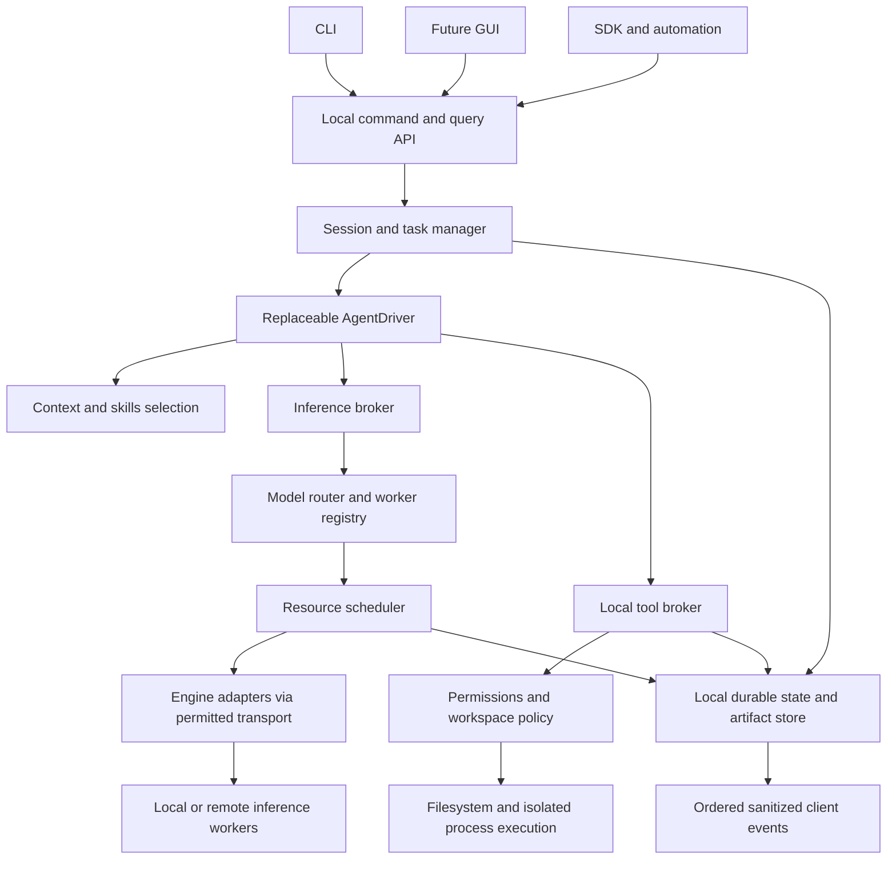

# V2 system architecture

Updated, 2026-10-02. The user authorized the narrow native driver and Stage 3 local runtime. Broader scheduler/GUI/daemon architecture below remains proposed. The pinned SDK was rejected in [FOUNDATION_DECISION.md](FOUNDATION_DECISION.md); current acceptance is in [CUSTOM_DRIVER_QUALIFICATION.md](CUSTOM_DRIVER_QUALIFICATION.md) and [STAGE3_LOCAL_RUNTIME.md](STAGE3_LOCAL_RUNTIME.md).

## Implemented Stage 3 slice

The actual entry point now constructs `CoreService.from_config` and a
`harness/cli/core_client.py` presentation adapter. CoreService owns providers,
session/task state, inference and tool brokers, permission service, skill scope,
versioned SQLite, checkpoints and private snapshot references. `NativeAgentDriver`
receives only serializable state and normalized responses; it has no broker or
filesystem handle. Its only outputs are proposals and explicit outcomes.

| Production boundary | Actual path/API |
| --- | --- |
| Composition and task loop | `harness/core/service.py`: `submit`, `run`, `resume`, `cancel` |
| Sessions and idempotent submissions | `harness/core/sessions.py`: `SessionManager.submit` |
| Driver and budget | `harness/core/native_driver.py`, `harness/core/context.py` |
| One inference allocation | `harness/core/inference.py`: `infer`, quarantine, operator idle confirmation |
| Worker/engine/profile contracts | `harness/core/runtime_models.py`: `Worker`, `ModelProfile`, `EngineAdapter`, `LlamaCppEngine` |
| Approved local effects | `harness/core/tool_broker.py`, `harness/core/permissions.py`, existing `harness/tools/registry.py` and sandbox |
| Durable state and preimages | `harness/storage/runtime.py`, `harness/storage/artifacts.py` |

The current CLI uses an in-process API and sanitized ordered events. Its session
history is persisted by the core. The new database is local application data,
outside OneDrive/repository; OS ownership refuses a second core for the same
canonical workspace under the same application-data root. Legacy journals are
preserved. Legacy undo can be explicitly restored through a new durable approval.
The older `AgentOrchestrator` remains a compatibility API and does not acquire
the new runtime's SQLite/recovery guarantees.

Stage 3 uses one selected text profile and serializes text/image inference on one
local allocation. This is not a physical GPU scheduler. Interrupted transport
quarantines that allocation; remote health alone is not proof it became idle.
Context counts are labeled UTF-8 estimates; advanced compaction and verified
tokenizers/profile manifests are later work. Process restart tests are not
power-loss durability certification. No real GPU session was used.

## Shape: modular local core, optional daemon

Start with one local Python process and explicit module boundaries. An in-process API supports CLI and tests. Later an authenticated local service exposes the same commands and events to GUI, SDK and automation. Avoid microservices, Redis, an external queue, or a vector database for the first release. Remote services perform inference only.



The diagram shows the broader proposed target, including unimplemented scheduling and clients. In the current slice, CoreService calls brokers; the driver cannot call them. Engine adapters receive model/input/cancellation data, not tool authority. Local Python extensions and approved shell commands remain trusted-host code, not an OS sandbox.

## Contracts

| Interface | Inputs and results | Authority |
| --- | --- | --- |
| `CoreService.submit_task` | workspace ID, user request, skill/agent profile, route constraints, request ID -> task ID | Validates client identity, scope and configuration |
| `AgentDriver.advance` | task/context snapshot, normalized inference events, completed tool observations -> proposals/outcome | Produces proposals; cannot grant or execute directly |
| `InferenceBroker.generate` | typed content, model profile, prompt version, limits, cancellation -> normalized stream | Validates disclosure; obtains scheduler lease; maps provider protocol |
| `ToolBroker.propose/execute` | tool schema/version, arguments, task/agent ID, policy scope -> approval/execution/result IDs | Only local execution authority |
| `PermissionService.decide` | canonical target, diff/content hash, command/environment/network scope -> deny/ask/scoped grant | Missing interactive resolver never means allow |
| `WorkerRegistry.observe` | authenticated manifest/health with timestamps -> versioned worker observation | Claims remain untrusted measurements until validated |
| `Scheduler.acquire/release` | resource requirements, task priority, attempt ID -> fenced lease | Does not load arbitrary models merely because a request exists |
| `MemoryService.propose/promote` | evidence-backed knowledge delta -> proposal/review/version | Promotion requires trusted approval |
| `StateStore.commit` | expected revision, events and state transitions -> sequence | Single authoritative local transaction boundary |

Content uses typed text, image, video and artifact parts; tool arguments are schema-validated JSON. Adapter-specific fields remain namespaced and validated. Errors have stable codes such as `unsupported_capability`, `approval_required`, `context_overflow`, `worker_unavailable`, `auth_failed`, `cancel_unconfirmed`, `conflict`, and `outcome_unknown`, plus scrubbed descriptions.

## IDs, state and event delivery

Use distinct IDs for workspace, session, task, agent, child relation, inference attempt, engine request, resource lease, tool execution, approval, artifact, checkpoint, and schedule occurrence. Client request idempotency keys prevent duplicate task submissions; they do not promise exactly-once external side effects.

Task state: `created -> queued -> running`, with `waiting_approval`, `waiting_child`, `waiting_worker`, `paused`, and `cancel_requested` intermediate states. Terminal results are `completed`, `failed`, or `cancelled`; `outcome_unknown` requires reconciliation, not a fabricated successful result. A completed conversation does not automatically mean tests passed.

Normalized events include task transitions, model/worker selection, queue wait, lease changes, inference start/deltas/finish, tool proposal, approval request/decision, execution intent/start/result, child relation/result, context compaction, knowledge proposal/promotion, cancellation acknowledgement, and recovery conflict. Each durable event carries schema version, IDs, monotonic per-session sequence, UTC timestamp, actor, state revision and sanitized payload.

Commit critical state transitions before broadcasting them. Clients subscribe from the last sequence and receive a snapshot plus replay after reconnect. Stream deltas can be batched into bounded sanitized chunks, but message completion and tool/approval outcomes are durable. Slow subscribers must not block execution: bound buffers, coalesce deltas, and offer catch-up reads. An in-process event bus is delivery plumbing, not the durable source of truth.

## Persistence and external effects

SQLite with transactions/schema migrations is the proposed authority store for sessions, tasks, agents, attempts, approvals, schedules, events, and artifact references. Local blobs store bounded outputs and immutable snapshots with hashes; logs reference them. Keep runtime state in a per-user local application-data directory keyed by canonical workspace identity, especially for this OneDrive workspace. Do not put a live WAL database under a sync directory by default.

For a write: resolve/authorize target, obtain write ownership, compare approved content hash, persist intent and immutable preimage, apply atomic replacement, persist result/postimage hash, then publish outcome. On restart, inspect hashes and intent status. Filesystem and SQLite are not one transaction; do not promise transactional exactly-once edits. External commands and MCP actions may be unrecoverable: present uncertainty and require reconciliation before retries.

Undo is an authorized new operation with its own intent and conflict checks. A missing backup is an error, never permission to delete. Runtime state and backup retention need quota, purge, and optional encryption controls.

## Client and job lifecycle

The CLI renders shared events and resolves approvals; it does not own policy or provider construction. Closing an in-process CLI stops that process; closing a client connected to the optional daemon does not stop an authorized daemon job. Make this distinction explicit. Running two cores against one workspace requires ownership locks and fencing or refusal; SQLite alone does not stop duplicate effects.

The daemon defaults to same-user local access, OS-owned discovery/token files, restricted named pipe/Unix socket or authenticated loopback API, origin/CSRF protection, and no network listener exposed by default. Automation is another authenticated client with a narrow grant, not an approval bypass. Secret references are resolved locally and omitted from event/query payloads.

## Proposed repository structure

```text
freecompute/
  pyproject.toml
  harness/
    api/                 # commands, queries, event contracts; local service later
    core/                # sessions, tasks, agent profiles, service composition
    agents/              # AgentDriver interface; optional pinned SDK adapters
    inference/           # normalized protocols, broker, token/context accounting
    workers/             # registry, health, manifests, location adapters
    engines/             # llama.cpp, OpenAI-compatible, vLLM, ComfyUI jobs
    transports/          # direct TLS/private-network/tunnel profiles, no silent fallback
    scheduling/          # resource pools, admission, leases, persistent jobs
    permissions/         # grants, approval binding, trusted config
    tools/               # workspace fs, processes, web, MCP broker
    skills/              # discovery, manifest validation, slash parsing, workflows
    memory/              # retrieval, proposals, promotion, context integration
    storage/             # SQLite schemas, migrations, artifacts, snapshots, recovery
    telemetry/           # measurements, uncertainty and timestamps
    clients/cli/         # CLI formatting and approval UI
  workers/               # minimal remote inference-only supervisor packages
  kaggle/                # generated notebook wrappers for canonical supervisor
  skills/                # bundled portable project skills
  knowledgebase/         # design and implementation decisions
  tests/
    unit/
    contract/            # fake protocols/workers and policy boundaries
    integration/         # local crash/process/artifact/recovery tests
    acceptance/          # opt-in real worker fixtures and recorded benchmarks
  apps/                  # future GUI, after approved client API
  docs/                  # future released user/developer documentation
```

This is a target layout, not a directory creation request. Move modules only when a staged migration needs the boundary; preserve the current entry point during migration. Centralize supervisor code and generate notebooks reproducibly rather than maintaining divergent copies. Keep lightweight CLI install separate from optional SDK/image/engine deployment dependencies.

## Telemetry truth

Separate queue time, transport connection time, prefill/TTFT, decode time, tool execution, approval wait and full task elapsed. Use tokenizer/server-reported token counts; label estimates. GPU free VRAM is an observation with age, not an allocatable promise. Show worker session deadline separately from supervisor/process/Linux uptime. Local quota estimates never masquerade as provider account balance. Stable prefixes improve cache opportunity; they do not guarantee 100% KV hits or sub-second TTFT.
